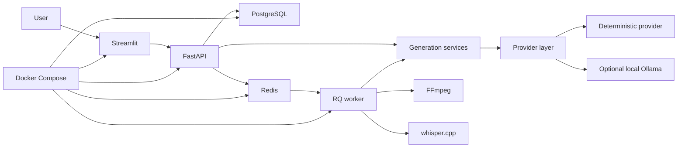

# Architecture

## Purpose

AI Content Repurposing Pipeline is a local-first system for turning transcript, audio, or video source material into structured content assets while preserving deterministic fallbacks and explicit local execution boundaries.

## Component Overview

- Streamlit frontend: local UI for generation, history, and media jobs.
- FastAPI backend: HTTP boundary for all frontend workflows.
- Generation services: transcript cleaning, analysis, brief generation, platform asset generation, and Markdown export.
- Provider layer: deterministic default provider and optional local Ollama provider.
- PostgreSQL: saved generation history.
- Alembic: schema migrations.
- Redis/RQ: asynchronous media-job queue.
- FFmpeg: local media conversion.
- whisper.cpp: local transcription.
- Docker Compose: optional containerized runtime.

## Text Generation Flow

`POST /content/generate` validates a `ContentGenerationRequest`, cleans the transcript, analyzes it, creates a content brief, generates platform assets, validates `PlatformContentAssets`, and returns a `ContentGenerationResponse` with Markdown export. This endpoint is stateless.

## Saved Generation Flow

`POST /generations` reuses the existing stateless generation workflow, stores the validated response in PostgreSQL, and returns a saved record. List responses exclude the original transcript and Markdown export. Full retrieval reconstructs stored JSON through the existing Pydantic schemas.

## Asynchronous Media Flow

`POST /media-jobs` streams an upload to a safe temporary location, enqueues an RQ job, and returns `202`. The worker converts media with FFmpeg, transcribes with whisper.cpp, normalizes segments into transcript text, reuses the content-generation service, optionally persists the result, updates safe job metadata, and deletes temporary files.

## Docker Compose Topology

The core stack includes PostgreSQL, Redis, migration service, API, and frontend. The optional `media` profile adds the worker. PostgreSQL and Redis are not exposed on host ports by default. API port `8000` and Streamlit port `8501` are exposed for local use.

## Provider Abstraction

Providers contain no FastAPI route logic. The deterministic provider is stable, local, and free of network/model requirements. The Ollama provider calls a local Ollama service only when explicitly requested and validates every provider result with Pydantic.

## PostgreSQL And Alembic

SQLAlchemy uses typed declarative mappings and generic JSON columns. Application startup does not call `Base.metadata.create_all()`. Schema creation is handled by Alembic migrations.

## Redis/RQ Job States

Media-job status is exposed through safe application schemas. Clients see allowed states, stages, progress, timestamps, transcription, generated content, saved record ID, or a safe failure message. Raw RQ objects and tracebacks are not exposed.

## Frontend HTTP Boundary

The frontend communicates with FastAPI through HTTP only. It does not import backend services, providers, repositories, database sessions, or models.

## Security Boundaries

Secrets are read from local environment files or environment variables and are not committed. `.env`, `.env.docker`, generated artifacts, upload data, and model binaries are ignored. Readiness and error responses avoid exposing URLs, credentials, SQL, subprocess output, or stack traces.

## Health And Readiness

`GET /health` preserves the original health response. `GET /health/live` checks process liveness only. `GET /health/ready` checks PostgreSQL and Redis only when configured as required.

## Native Versus Docker Execution

Native Windows execution remains supported with local Python, PostgreSQL, Redis, FFmpeg, whisper.cpp, and Streamlit. Docker Compose is an additional runtime path using Linux containers. Native Windows media workers use `SimpleWorker` for compatibility; Linux containers use the normal RQ worker model.

## Limitations

The project is not a hosted production deployment. It has no authentication, multi-user ownership, publishing automation, paid AI provider integration, cloud transcription, automatic model downloads, or guarantee that generated content is publication-ready without review.
